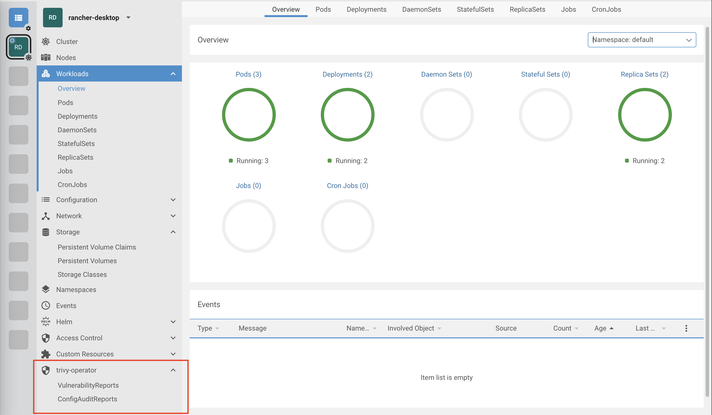

# Trivy-Operator Lens Extension

> This is a [Lens][lens] extension for [trivy-operator][trivy-operator] which provides visibility into
> vulnerability assessment reports for Kubernetes workloads stored as [custom security resources][trivy-operator-crds].

[![GitHub Release][release-img]][releases]
[![GitHub Build Actions][build-action-img]][actions]
[![License][license-img]][license]
[![GitHub All Releases][github-all-releases-img]][releases]

## Installation

This guide shows how to install the extension either from pre-built binary releases or source.

### Prerequisites

* Lens >= [4.0][min-lens] should first be [installed][lens-installation].
* Follow trivy-operator [Getting Started] guide to understand how trivy-operator is initialized and how it generates security
  reports, which are then stored as custom resources.

### Compatibility Matrix

The following matrix indicates versions of this extension and compatible Lens releases.

| Lens | Extension                                                                                  |
|------|--------------------------------------------------------------------------------------------|
| 4.0  | [0.0.2](https://github.com/aquasecurity/trivy-operator-lens-extension/releases/tag/v0.0.2) |

### From the Binary Releases

Every [release][releases] of Lens extension for trivy-operator provides the tarball-file that can be manually
downloaded and installed. Alternatively, you can copy the download URL of the release artifact to paste it in the
**Manage Lens Extensions** page.

1. Download your desired version from GitHub [releases] page or GitHub
   [package registry][package-registry]. Alternatively, just copy the download URL of the release artifact.
2. Open Lens application and select **Lens** menu, and then click **Extensions** item, or press
   <kbd>Shift</kbd> + <kbd>Command</kbd> + <kbd>E</kbd> to open the **Manage Lens Extensions** page.
3. Specify the path (.tar, .tgz) or download URL to the extension package and click **Install**.
   
4. If everything is fine, you'll see the `@aquasecurity/trivy-operator-lens-extension` extension listed under
   **Installed Extensions**. Click **Enable** to enable it.
   
5. Close the **Manage Lens Extensions** page and verify that the **trivy-operator** menu item shows up in the main menu.
   

### From Source (Linux, macOS)

Building from source is slightly more involved, but it's the best way to go if you want to test the latest (pre-release)
version of the extension.

You must have a working [Node.js] environment.

1. Clone the source code:
   ```
   git clone https://github.com/aquasecurity/trivy-operator-lens-extension.git
   cd trivy-operator-lens-extensions
   ```
2. Build the extension's package:
   ```
   npm install && npm run build
   ```
3. Create a tarball from a package:
   ```
   npm pack
   ```
   This will create the `aquasecurity-trivy-operator-lens-extension-$VERSION.tgz` tarball in the root directory.
4. Open Lens application and select **Lens** menu, and then click **Extensions** item, or press
   <kbd>Shift</kbd> + <kbd>Command</kbd> + <kbd>E</kbd> to open the **Manage Lens Extensions** page.
5. Specify the path the `aquasecurity-trivy-operator-lens-extension-$VERSION.tgz` extension package and click **Install**.
6. If everything goes fine, you'll see the `@aquasecurity/trivy-operator-lens-extension` extension listed under
   **Installed Extensions**.
   

## Getting Started

> **NOTE**: As the source code of the extension is evolving very fast, some screenshots shown below
> may be outdated. We'll also update this section with more examples.

- VulnerabilityReports

  

- ConfigAuditReports and ClusterConfigAuditReports

  


[lens]: https://github.com/lensapp/lens
[trivy-operator]: https://github.com/aquasecurity/trivy-operator
[trivy-operator-crds]: https://aquasecurity.github.io/trivy-operator/latest/crds/
[Getting Started]: https://aquasecurity.github.io/trivy-operator/latest/operator/getting-started/

[lens-installation]: https://github.com/lensapp/lens#installation
[lens-releases]: https://github.com/lensapp/lens/releases
[release-img]: https://img.shields.io/github/release/aquasecurity/trivy-operator-lens-extension.svg?logo=github
[releases]: https://github.com/aquasecurity/trivy-operator-lens-extension/releases
[github-all-releases-img]: https://img.shields.io/github/downloads/aquasecurity/trivy-operator-lens-extension/total?logo=github
[package-registry]: https://github.com/aquasecurity/trivy-operator-lens-extension/packages/520430
[build-action-img]: https://github.com/aquasecurity/trivy-operator-lens-extension/workflows/Build/badge.svg
[actions]: https://github.com/aquasecurity/trivy-operator-lens-extension/actions
[license]: https://github.com/aquasecurity/trivy-operator-lens-extension/blob/master/LICENSE
[license-img]: https://img.shields.io/github/license/aquasecurity/trivy-operator-lens-extension

[min-lens]: https://github.com/lensapp/lens/releases/tag/v4.0.0
[Node.js]: https://nodejs.org/en/download/